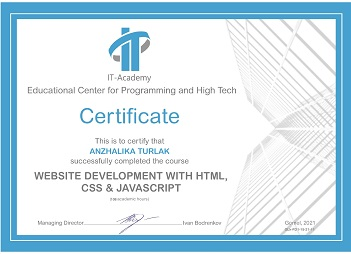
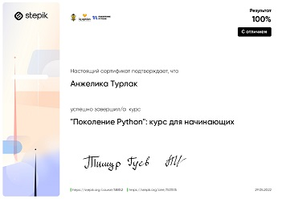
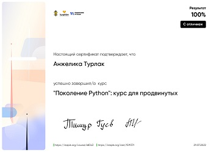
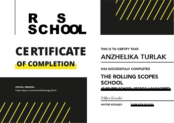

## Anzhalika Turlak 
**Junior Javascript developer**<br>
**Batumi, Georgia| Age: 33 years** 

---

### Contacts  
 : +372 29 385 26 47, +995 59 111 93 05  
 : [@Lika_by](https://t.me/Lika_by)  
 : [293852647@mail.ru](293852647@mail.ru)  
 : [Anzhalika Turlak](https://www.linkedin.com/in/anzhalika-turlak-b3307414a/)  


### About me
---
At 33, I'm looking to change my career and become a front-end developer. I have over 10 years of experience in the accounting field, but my passion for learning and passion for technology and the creative process led me to web development.
I took offline training in web design basics, where I mastered HTML, CSS and basic JavaScript skills. Also, I have successfully completed online courses in Python, including Django, SQLite and Flask. These courses gave me an understanding of the full cycle of web application development and allowed me to create my own projects.

I am sociable, open for cooperation and appreciate teamwork. I like to share knowledge and ideas with other members of a large community in order to find the best solutions together.
I believe that my ability to learn and acquire new skills will help me become an experienced Frontend Developer.


### Education

|      Period      | Educational institution | Speciality |  
| :--- | :--- | :--- |  
| `2008-2010` | Gomel State Road Construction College | banking / Economist |  
| `2011-2015` | Belarusian Trade and Economic University of Consumer Cooperatives | Accounting analysis and audit / Economist |  
| `2017-2019` | SUKHOI STATE TECHNICAL UNIVERSITY OF GOMEL | Information systems software / Software engineer |  

### Skills
   * HTML, CSS (Sass)  
   * JavaScript base
   * Python
   * Django
   * SQLite
   * Flask
   * Git
   * PyCharm, VS Code


### Courses
 IT-Academy
> 2021 Website development HTML, CSS, base JavaScript

 Stepik
> 2022 Generation Python Course for Beginners

 Stepik
> 2023 Python Generation Advanced Course

 IT-Overone
> 2023 Python website development<br>

 RS school
> 2023 JS/FE Pre-School 2023Q2<br>

      


### Languages   
   * Russian (native)
   * English (A2 --> in progress B1)


### Sample code
---

Write a program that multiplies two matrices.

##### Input data format
The program takes two natural numbers as input n and m is the number of rows and columns in the first matrix, then the elements of the first matrix, then the empty string. Numbers follow m and k is the number of rows and columns of the second matrix, then the elements of the second matrix.

##### Output format
The program should output the resulting matrix, separating the elements with a space character.

```
n1, m1 = [int(i) for i in input().split()]
mat1 =[[int(i) for i in input().split()] for j in range(n1)]
input()
m2, k2 = [int(i) for i in input().split()]
mat2 = [[int(i) for i in input().split()] for j in range(m2)]
mat_res = [[0 for row in range(k2)] for col in range(n1)]
for i in range(n1):
    mat_res_ = 0
    for j in range(k2):
        for k in range(m1):
            mat_res[i][j] += mat1[i][k]*mat2[k][j] 
    print(*mat_res[i])  
```